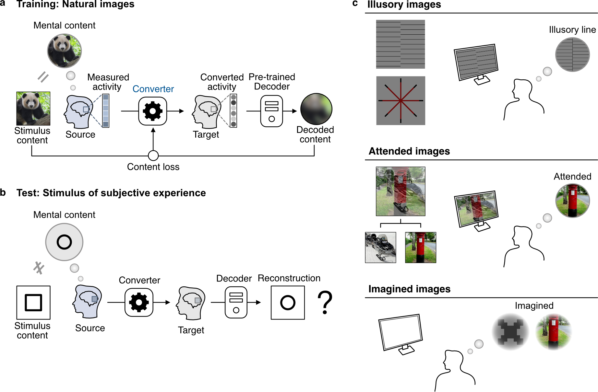

<!-- Improved compatibility of back to top link: See: https://github.com/othneildrew/Best-README-Template/pull/73 -->
<a name="readme-top"></a>

<!-- PROJECT SHIELDS -->
[![Contributors][contributors-shield]][contributors-url]
[![Forks][forks-shield]][forks-url]
[![Stargazers][stars-shield]][stars-url]
[![Issues][issues-shield]][issues-url]

<br />

<h2 align="center">Inter-individual reconstruction of subjective experience from brain activity
</h2>

  <p align="center">
Haibao Wang, Fan L. Cheng, Shuntaro C. Aoki, Misato Tanaka, Yoshihiro Nagano, Hideki Izumi, <br>Yukiyasu Kamitani
</p>

<br>
<br>

<div align="center">

  <a href="https://github.com/KamitaniLab/InterIndividualSubjectiveExperienceReconstruction/blob/main/">
    
  </a> 

</div>

<!-- MARKDOWN LINKS & IMAGES -->
<!-- https://www.markdownguide.org/basic-syntax/#reference-style-links -->
[contributors-shield]: https://img.shields.io/github/contributors/KamitaniLab/InterIndividualSubjectiveExperienceReconstruction.svg?style=for-the-badge&color=blue
[contributors-url]: https://github.com/KamitaniLab/InterIndividualSubjectiveExperienceReconstruction/graphs/contributors
[forks-shield]: https://img.shields.io/github/forks/KamitaniLab/InterIndividualSubjectiveExperienceReconstruction.svg?style=for-the-badge&color=blue
[forks-url]: https://github.com/KamitaniLab/InterIndividualSubjectiveExperienceReconstruction/forks
[stars-shield]: https://img.shields.io/github/stars/KamitaniLab/InterIndividualSubjectiveExperienceReconstruction.svg?style=for-the-badge&color=blue
[stars-url]: https://github.com/KamitaniLab/InterIndividualSubjectiveExperienceReconstruction/stargazers
[issues-shield]: https://img.shields.io/github/issues/KamitaniLab/InterIndividualSubjectiveExperienceReconstruction.svg?style=for-the-badge&color=blue
[issues-url]: https://github.com/KamitaniLab/InterIndividualSubjectiveExperienceReconstruction/issues
[license-shield]: https://img.shields.io/github/license/KamitaniLab/InterIndividualSubjectiveExperienceReconstruction.svg?style=for-the-badge&color=blue
[license-url]: https://github.com/KamitaniLab/InterIndividualSubjectiveExperienceReconstruction/blob/main/LICENSE.txt


[//]: # (## Repository Structure)

[//]: # ()
[//]: # (```text)

[//]: # (InterIndividualSubjectiveExperienceReconstruction/)

[//]: # (├── README.md                                  # Project overview and usage instructions)

[//]: # (├── env.yaml                                   # Main Conda environment)

[//]: # (├── figure/)

[//]: # (│   └── NCC.png                                # Overview figure)

[//]: # (├── data/                                      # Data download scripts and organized data folders)

[//]: # (│   ├── README.md                              # Data preparation instructions)

[//]: # (│   ├── download.py                            # Data downloader)

[//]: # (│   ├── files.json                             # Download file metadata)

[//]: # (│   ├── fmri/                                  # fMRI datasets)

[//]: # (│   │   ├── attention/)

[//]: # (│   │   ├── illusion/)

[//]: # (│   │   └── imagery/)

[//]: # (│   ├── pre-trained/                           # Pre-trained decoders and converters)

[//]: # (│   │   ├── converters/)

[//]: # (│   │   └── decoders/)

[//]: # (│   ├── stimulus_feature/                      # DNN stimulus features)

[//]: # (│   └── test_image/                            # Ground truth/test images for evaluation)

[//]: # (│       ├── attention/)

[//]: # (│       ├── illusion/)

[//]: # (│       └── imagery/)

[//]: # (├── neural_code_conversion/                    # Neural code converter training and testing)

[//]: # (│   ├── attention/)

[//]: # (│   │   ├── NCC_train.py                       # Train converters for attention)

[//]: # (│   │   ├── NCC_test.py                        # Test converters for attention)

[//]: # (│   │   └── README.md)

[//]: # (│   ├── illusion/)

[//]: # (│   │   ├── NCC_train.py                       # Train converters for illusion)

[//]: # (│   │   ├── NCC_test.py                        # Test converters for illusion)

[//]: # (│   │   └── README.md)

[//]: # (│   └── imagery/)

[//]: # (│       ├── NCC_train.py                       # Train converters for imagery)

[//]: # (│       ├── NCC_test.py                        # Test converters for imagery)

[//]: # (│       └── README.md)

[//]: # (├── reconstruction/                            # Image reconstruction from decoded features)

[//]: # (│   ├── attention_imagery/)

[//]: # (│   │   ├── recon_icnn_image_gd_dist_attention.py  # Attention reconstruction)

[//]: # (│   │   ├── recon_icnn_image_gd_dist_imagery.py    # Imagery reconstruction)

[//]: # (│   │   ├── env.yaml)

[//]: # (│   │   └── README.md)

[//]: # (│   └── illusion/)

[//]: # (│       ├── recon_feature_to_GAN.py            # Illusion reconstruction with averaged trials)

[//]: # (│       ├── recon_feature_to_GAN_single_trial.py  # Illusion reconstruction for all trials)

[//]: # (│       ├── download.py)

[//]: # (│       └── README.md)

[//]: # (└── evaluation/                                # Quantitative evaluation scripts)

[//]: # (    ├── conversion_accuracy/                   # Neural code conversion accuracy evaluation)

[//]: # (    └── reconstruction_evaluation/             # Reconstruction quality evaluation)

[//]: # (        ├── attention/)

[//]: # (        │   ├── recon_image_eval.py            # Pixel-level attention reconstruction evaluation)

[//]: # (        │   └── recon_image_eval_dnn.py        # DNN-feature attention reconstruction evaluation)

[//]: # (        ├── illusion/)

[//]: # (        │   ├── Eval_color_illusion_vs_control.py  # Color illusion evaluation)

[//]: # (        │   ├── Eval_line_global.py            # Global line-orientation evaluation)

[//]: # (        │   └── Eval_line_local.py             # Local line-orientation evaluation)

[//]: # (        └── imagery/)

[//]: # (            ├── artificial/)

[//]: # (            │   ├── recon_image_eval.py        # Artificial imagery pixel-level evaluation)

[//]: # (            │   └── recon_image_eval_dnn.py    # Artificial imagery DNN-feature evaluation)

[//]: # (            └── natural/)

[//]: # (                ├── recon_image_eval.py        # Natural imagery pixel-level evaluation)

[//]: # (                └── recon_image_eval_dnn.py    # Natural imagery DNN-feature evaluation)

[//]: # (```)


## Getting Started

### Installation
To begin, clone the repository on your local machine, using git clone and pasting the url of this project:
   ```sh
   git clone https://github.com/KamitaniLab/InterIndividualSubjectiveExperienceReconstruction.git
   ````
### Build Environment

Step1: Navigate to the base directory and create the Conda environment:
  ```sh
  conda env create -f env.yaml
  ```
Step2: Activate the environment:
  ```sh
  conda activate NCC
```

### Download Data

To use this project, you'll need to download and organize the required data:
- Download the training brain data for veridical perception from [Figshare](https://figshare.com/articles/dataset/Inter-individual_deep_image_reconstruction/17985578).
- Download the test brain data for visual illusion from [Figshare](https://figshare.com/articles/dataset/Reconstructing_visual_illusory_experiences_from_human_brain_activity/23590302).
- Download the test brain data for visual attention from [Figshare](https://figshare.com/articles/dataset/Attentionally_modulated_subjective_images_reconstructed_from_brain_activity/13474629).
- Download the test brain data for visual imagery from [Figshare](https://figshare.com/articles/dataset/Deep_Image_Reconstruction/7033577).
- Download the DNN features of stimuli from [Figshare](https://figshare.com/articles/dataset/Inter-individual_and_inter-site_neural_code_conversion/26860954)

Alternatively, you can use the following commands to download specific data (The data will be automatically extracted and organized into the designated directory):
 ```sh
# In "data" directory:
# To download the fMRI data for visual illusion:
python download.py fmri-illusion

# To download the fMRI data for visual attention:
python download.py fmri-attention

# To download the fMRI data for visual imagery:
python download.py fmri-imagery

# download the DNN features of training images:
python download.py stimulus_feature
 ```

### Download Pre-trained Decoders

To use this project, you'll need to download the required pre-trained decoders from [Figshare](https://figshare.com/articles/dataset/Inter-individual_and_inter-site_neural_code_conversion/26860954) with the following commands:

```sh
# Pre-trained decoders for visual illusion:
python download.py pre-trained-decoders-illusion

# Pre-trained decoders for visual attention and imagery:
# python download.py pre-trained-decoders-attention_imagery
```

If you prefer to train the decoders yourself (approximately 2 days per subject), detailed instructions and scripts are available in the [feature-decoding](https://github.com/KamitaniLab/feature-decoding) repository.

## Usage

### Train Neural Code Converters

To train the neural code converters using content loss for subject pairs, navigate to the corresponding subdirectory under `neural_code_conversion`.

For example, to train the converter for visual illusion, navigate to `neural_code_conversion/illusion` and run:

```sh
python NCC_train.py --cuda
```

* **Note**: Use the `--cuda` flag when running on a GPU server. Omit `--cuda` if training on a CPU server.

Training one subject pair usually takes about 15 hours due to the large computational requirements. You can also download the pre-trained converters from [Figshare](https://figshare.com/articles/dataset/Inter-individual_and_inter-site_neural_code_conversion/26860954) with the following commands:

```sh
# In "data" directory:
# Pre-trained converters for visual illusion:
python download.py pre-trained-converters-illusion

# Pre-trained converters for visual attention and imagery:
# python download.py pre-trained-converters-attention_imagery
```

### Test Neural Code Converters

#### DNN Feature Decoding

To decode DNN features from converted brain activities, navigate to the corresponding subdirectory under `neural_code_conversion`.

For example, for visual illusion, navigate to `neural_code_conversion/illusion` and run:

```sh
python NCC_test.py
```

#### Image Reconstruction

To reconstruct images from the decoded features:

1. Navigate to the `reconstruction` directory.
2. Follow the provided README and reconstruction demo for detailed instructions on setting up the environment and usage.
3. Modify the directory of the decoded features in the script as needed to reconstruct images.

### Quantitative Evaluation
The quantitative evaluations are presented in terms of conversion accuracy and reconstruction quality.

#### Conversion Accuracy
To calculate raw correlations for conversion accuracy, navigate to the `evaluation/conversion_accuracy` directory and run:

  ```sh
  # pattern correlation
  python fmri_pattern_corr_content_loss.py
  
  # profile correlation
  python fmri_profile_corr_content_loss.py
  ```

#### Evaluation of reconstruction
To quantitatively evaluate the reconstructed images, navigate to the `evaluation/reconstruction_evaluation` directory.

For example, to evaluate illusion reconstruction, navigate to the `illusion` directory and run:

```sh
python Eval_color_illusion_vs_control.py
python Eval_line_global.py
python Eval_line_local.py
```

To evaluate attention reconstruction, navigate to the `attention` directory and run:

```sh
python recon_image_eval.py
python recon_image_eval_dnn.py
```

Imagery reconstruction can be evaluated in the same way by navigating to the corresponding `imagery` subdirectory.

Due to licensing restrictions, the ground truth/test images for attention and imagery reconstruction evaluation are not included in this repository. Please request and download them using this [link](https://forms.gle/ujvA34948Xg49jdn9), then organize the downloaded images under `data/test_image/attention` and `data/test_image/imagery`.

<p align="right">(<a href="#readme-top">back to top</a>)</p>
